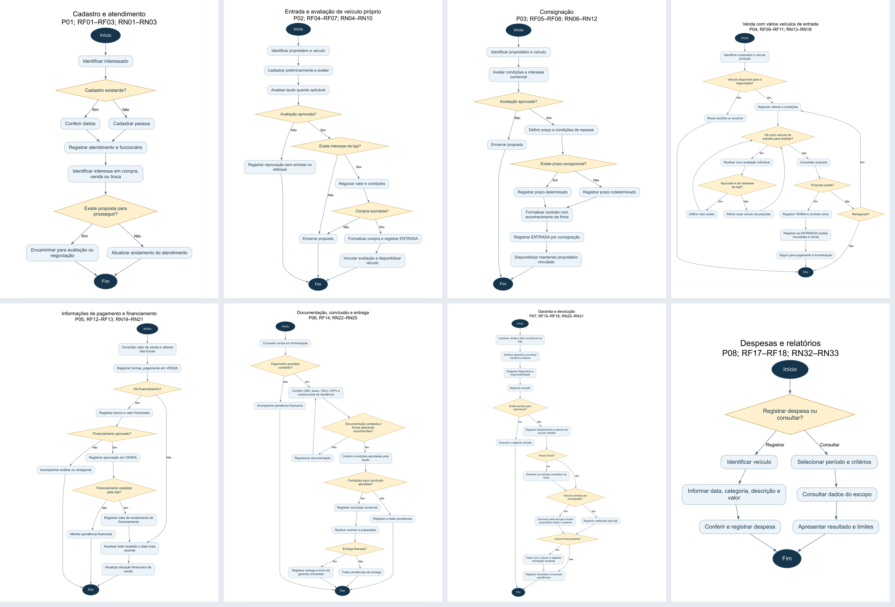
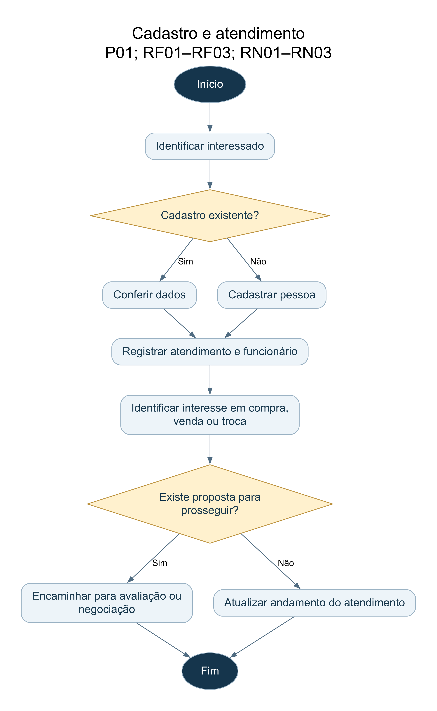
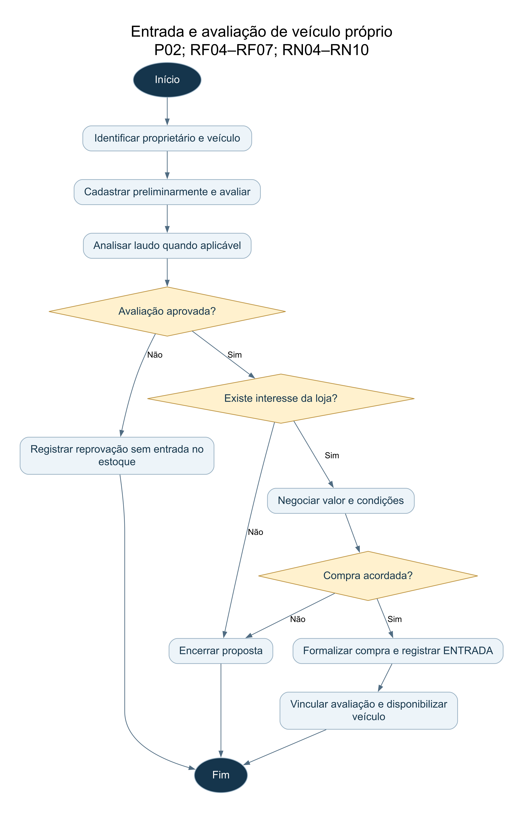
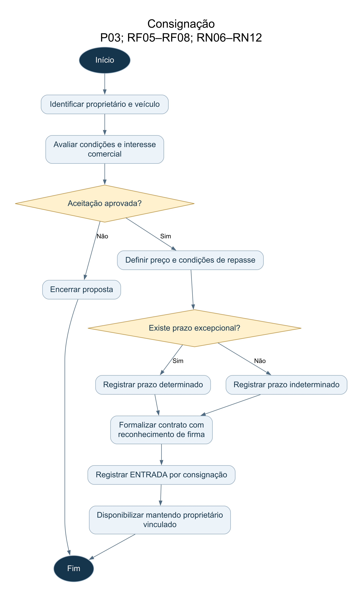
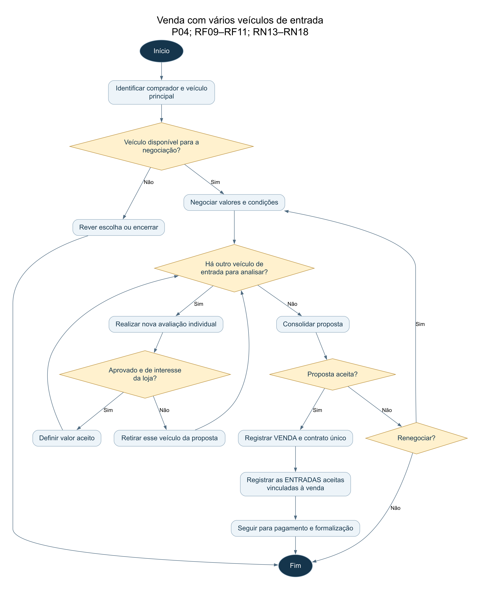
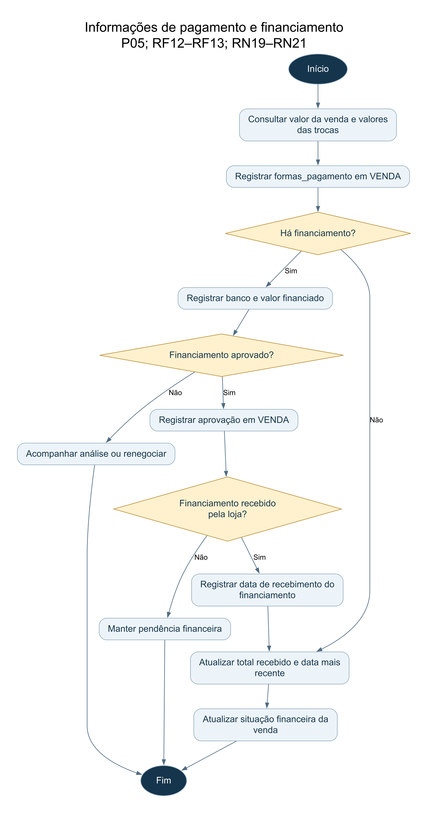
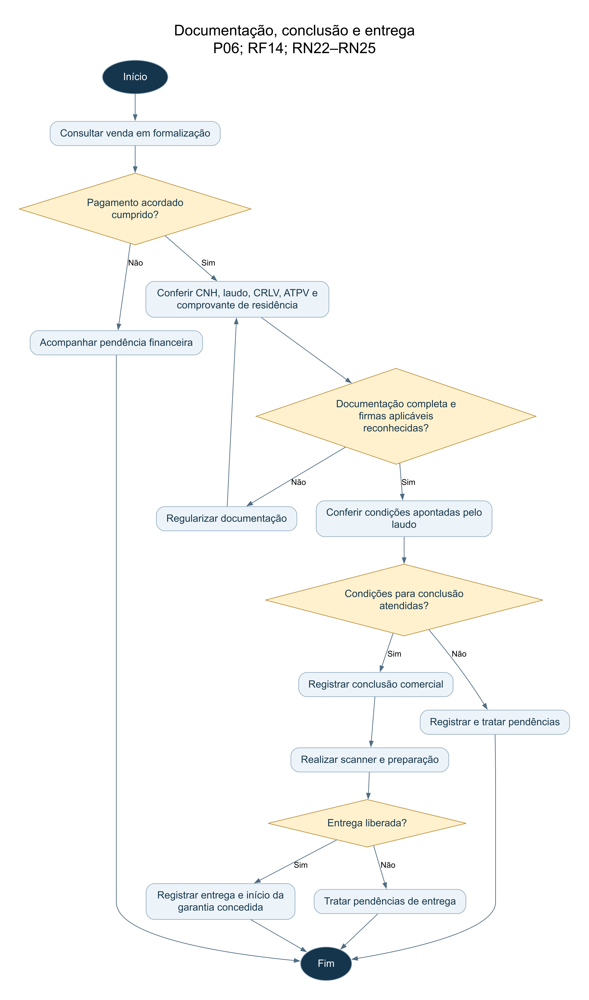
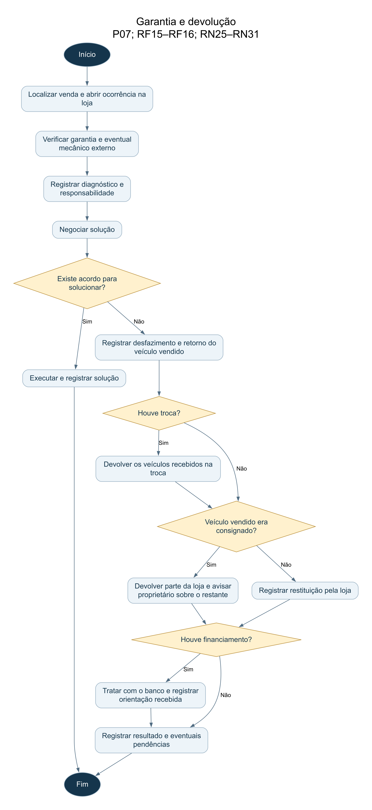
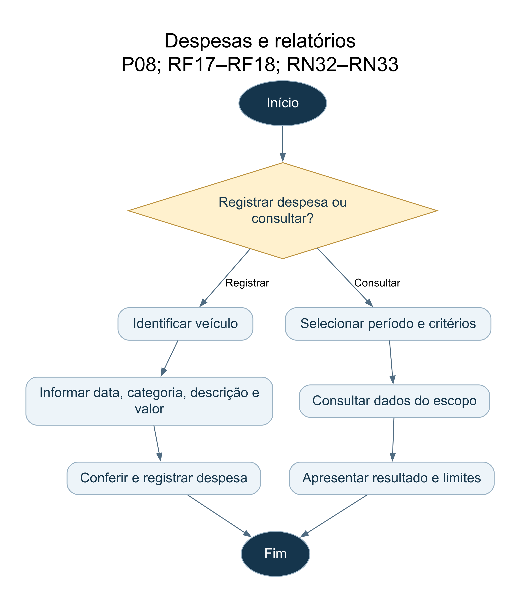

# Projeto ERP — Multiplikar Automóveis

**Projeto Integrador - Modelagem de Dados - Primeira Entrega**  
**Primeira entrega: modelo conceitual**

## Sumário

1. [Identificação da equipe](#secao-1)
2. [Caracterização da empresa](#secao-2)
3. [Justificativa da escolha](#secao-3)
4. [Problemas identificados](#secao-4)
5. [Processos de negócio](#secao-5)
6. [Requisitos funcionais](#secao-6)
7. [Requisitos não funcionais](#secao-7)
8. [Regras de negócio](#secao-8)
9. [Restrições e políticas organizacionais](#secao-9)
10. [Fluxogramas](#secao-10)
11. [Entidades](#secao-11)
12. [Atributos](#secao-12)
13. [Relacionamentos](#secao-13)
14. [Cardinalidades](#secao-14)
15. [Dicionário de dados conceitual](#secao-15)
16. [DER](#secao-16)
17. [Justificativas técnicas](#secao-17)
18. [Conclusão](#secao-18)

<a id="secao-1"></a>

## 1. Identificação da equipe

### 1.1. Integrantes

1. Ana Beatriz Morais Lessa
2. Andrey Azevedo Veloso
3. Aquiles Santana da Silva
4. Brenno Lima do Vale
5. Caique Martins Santos
6. David Alejandro Delgado
7. Erin Jesus Olivera
8. Jocerlan Diniz dos Santos
9. Nicolas Dias da Silva

| Campo | Informação |
|---|---|
| Projeto | Projeto Integrador — Modelagem de Dados |
| Empresa analisada | Multiplikar Automóveis |
| Turma | Engenharia de Software - Manhã/Matutino |
| Disciplina |MODELAGEM DE BANCO DE DADOS |
| Professor(a) | Clóvis Ferraro |
| Instituição | UNICID |
| Data de submissão |2° Semestre - Eng. Software |
| Repositório GitHub | (https://github.com/andreyveloso/modelagem-banco-multiplikar-automoveis) |

Observação: As informações acadêmicas e a estrutura do repositório foram revisadas pelo grupo para a submissão desta primeira entrega.

### 1.2. Contribuições da equipe

| Integrante | Contribuição realizada | Evidência |
|---|---|---|
| Ana Beatriz Morais Lessa | Organização das regras de negócio e políticas organizacionais. | Seções 8 e 9 |
| Andrey Azevedo Veloso | Caracterização da empresa, justificativa, levantamento de problemas, especificação de requisitos funcionais e não funcionais, identificação de entidades, atributos, relacionamentos e conclusão do projeto. | Seções 1, 2, 3, 4, 6, 7, 11, 12, 13 e 18 |
| Aquiles Santana da Silva | Descrição dos processos P01 a P04 e dos fluxogramas correspondentes. | Seções 5 e 10 |
| Brenno Lima do Vale | Elaboração do DER em notação de Chen e organização e registro do Diário de Bordo. | Seção 16, Seção 1.3 e pasta `docs/der` |
| Caique Martins Santos | Descrição das entidades E01 a E05 no dicionário conceitual. | Seção 15 |
| David Alejandro Delgado | Descrição das entidades E06 a E10 no dicionário conceitual. | Seção 15 |
| Erin Jesus Olivera | Justificativas técnicas e consolidação da documentação. | Seção 17 |
| Jocerlan Diniz dos Santos | Análise de cardinalidades pelo Método Vá e Volte. | Seção 14 |
| Nicolas Dias da Silva | Descrição dos processos P05 a P08 e seus fluxogramas. | Seções 5 e 10 |

As responsabilidades foram divididas entre os integrantes para cobrir todas as etapas solicitadas no manual, e realizamos reuniões conjuntas para alinhar o DER e validar a coerência geral do modelo.

### 1.3. Diário de bordo
O registro contínuo das atividades, evolução do modelo e acompanhamento das tarefas do grupo foi documentado aula a aula diretamente no modelo oficial de Diário de Bordo disponibilizado pelo
professor Clóvis Ferraro, consolidando as discussões presenciais e a participação de cada integrante ao longo do semestre.

<a id="secao-2"></a>

## 2. Caracterização da empresa

### 2.1. Identificação

| Aspecto | Informação disponível no levantamento |
|---|---|
| Nome | Multiplikar Automóveis. |
| Segmento | Comércio de veículos. |
| Localização | Bairro Vila São Geraldo; cidade e endereço não informados. |
| Atuação | Aproximadamente dois anos na data do briefing. |
| Equipe | Cerca de seis funcionários. |
| Produtos | Veículos novos, seminovos e usados. |
| Controle atual | Sistema RevendaMais (briefing, p. 7); este projeto propõe a modelagem de um banco relacional integrado próprio. |

A Multiplikar Automóveis é uma loja de veículos (novos, seminovos e usados) localizada no bairro Vila São Geraldo. Com cerca de dois anos de mercado e uma equipe enxuta de seis colaboradores, a empresa atua na compra, venda e intermediação de veículos consignados.

### 2.2. Atividades e público

A loja atende clientes interessados em comprar, vender ou trocar veículos. As operações incluem aquisição direta e recebimento de automóveis em consignação. O levantamento também prevê o atendimento a pessoas físicas e jurídicas.

Os processos descritos envolvem colaboradores, especialistas em vistoria técnica, mecânicos parceiros para garantia e instituições financeiras. As atividades incluem atendimento, avaliação, negociação, formalização de contratos, conferência documental, preparação para entrega e assistência de garantia.

### 2.3. Setores e modo de operação

A partir dos processos levantados, organizamos a operação em três frentes práticas:
1. **Comercial / Vendas:** atendimento inicial aos clientes, apresentação dos veículos do estoque, negociação de propostas, fechamento de vendas e prospecção de veículos para troca ou consignação.
2. **Avaliação Técnica e Pátio:** inspeção física e mecânica dos automóveis ofertados, conferência de laudos cautelares, testes de scanner eletrônico e preparação dos veículos para entrega.
3. **Administrativo / Financeiro e Pós-Venda:** conferência de documentos, formalização de contratos, acompanhamento dos repasses de financiamento, registro de despesas e atendimento de ocorrências de garantia.

O fluxo começa com o atendimento e a avaliação do veículo oferecido. Quando há aprovação e interesse comercial, o veículo é registrado como compra própria, consignação ou entrada em troca. Na venda, relacionamos o veículo ao comprador e às condições acordadas. A conclusão e a entrega consideram as condições financeiras, o laudo e a documentação; a entrega marca o início da garantia prevista no modelo.

### 2.4. Fontes e delimitação do estudo

Para realizar este trabalho, nosso grupo analisou o [Briefing Inicial Completo](docs/fontes/briefing-completo.pdf) da empresa e seguiu as diretrizes do [Manual da Primeira Entrega](docs/fontes/manual-primeira-entrega.pdf). O levantamento aponta que a empresa utiliza a ferramenta comercial RevendaMais no balcão (página 7, item 12 do briefing). Entretanto, o sistema atual não centraliza adequadamente as avaliações mecânicas, os laudos cautelares, o recebimento de mais de um carro como entrada em negociações e as ordens de garantia pós-venda. O objetivo do nosso projeto é justamente estruturar um banco de dados relacional integrado para conectar todas essas pontas.

O escopo desta primeira entrega cobre: cadastro de pessoas e colaboradores, atendimento a interessados, avaliação técnica e laudos de vistoria, modalidades de entrada (compra direta, consignação e troca), fechamento de vendas com controle documental e formas de pagamento, ocorrências de garantia e rateio de despesas por veículo. Outros módulos, como folha de pagamento e comissões externas, não fazem parte do escopo inicial e serão tratados em etapas posteriores do curso.

Todas as decisões tomadas pelo grupo estão justificadas na Seção 17. Como solicitado nesta fase, focamos na construção do modelo conceitual (diagrama DER e dicionário de dados); as tabelas físicas, tipos SQL e normalização serão feitos nas próximas entregas.

<a id="secao-3"></a>

## 3. Justificativa da escolha

Escolhemos a Multiplikar Automóveis porque o comércio automotivo de seminovos oferece um cenário muito prático e interessante para a modelagem de banco de dados. Diferente de um comércio tradicional com vendas simples de produtos de prateleira, uma revenda lida com transações complexas: veículos são comprados de particulares, deixados por clientes em consignação ou aceitos como parte do pagamento (troca).

Além disso, a existência de vistorias técnicas com laudos cautelares, aprovação de financiamento bancário e atendimento de garantia na própria loja faz com que o fluxo de informações seja intenso. Atualmente, os controles descentralizados geram retrabalho e risco de informações desencontradas entre o pátio, a oficina e a parte financeira. A modelagem de um banco relacional integrado é fundamental para organizar essas rotinas e dar confiabilidade à gestão da loja.

<a id="secao-4"></a>

## 4. Problemas identificados

O uso de planilhas sem integração pode levar a retrabalho, divergências entre registros e dificuldade para acompanhar veículos e atendimentos ao longo das etapas. Com base no briefing e nos processos descritos, organizamos os problemas e as necessidades correspondentes:

| ID | Problema Operacional Identificado | Consequência no Negócio | Necessidade do Sistema | RF |
|---|---|---|---|---|
| PROB01 | Registros de uma pessoa podem ficar separados quando ela compra, vende ou consigna. | Cadastros repetidos, histórico fragmentado e retrabalho de digitação. | Unificar o cadastro com múltiplos papéis associados à mesma pessoa. | RF01–RF03 |
| PROB02 | Falta de vínculo entre laudo técnico, avaliação e aceitação do veículo. | Dificuldade para consultar o histórico da avaliação e do estado informado do carro. | Vincular a avaliação técnica e o laudo cautelar à entrada do veículo. | RF04–RF06 |
| PROB03 | Coexistência de modalidades distintas de entrada (compra própria, consignação e troca). | Confusão sobre titularidade do bem, prazos e regras específicas de repasse financeiro. | Distinguir as modalidades de entrada e seus respectivos contratos. | RF07–RF08 |
| PROB04 | Acompanhamento manual da disponibilidade de veículos no pátio. | Possibilidade de divergência de status ou de negociações simultâneas para o mesmo automóvel. | Controle centralizado de disponibilidade e bloqueio de vendas conflitantes. | RF09–RF10 |
| PROB05 | Recebimento de múltiplos veículos como parte do pagamento na mesma venda. | Inconsistência na composição do saldo da venda e perda do vínculo individual de cada entrada. | Registrar múltiplos veículos de troca vinculados à mesma transação. | RF11 |
| PROB06 | Descasamento entre aprovação de crédito e efetivo recebimento bancário. | Baixa prematura de valores não compensados e divergências financeiras. | Distinguir aprovação bancária do efetivo repasse à loja. | RF12–RF13 |
| PROB07 | Dificuldade para acompanhar pendências documentais ou de laudo antes da entrega. | Risco de desencontro entre a situação documental e a liberação do veículo. | Validar requisitos documentais e técnicos antes da liberação da entrega. | RF14 |
| PROB08 | Descontrole de prazos de garantia e procedimentos de devolução em vendas desfeitas. | Insegurança no pós-venda, perda do histórico de manutenções e desorganização na devolução de bens. | Controlar ocorrências de garantia e registrar as restituições em cancelamentos. | RF15–RF16 |
| PROB09 | Dificuldade na apuração de despesas por veículo e consolidação de relatórios gerenciais. | Falta de clareza sobre o lucro real de cada automóvel comercializado. | Vincular custos diretamente ao veículo e gerar relatórios gerenciais. | RF17–RF18 |
| PROB10 | Falta de integração entre condições contratuais acordadas e registros operacionais. | Divergência entre valores negociados, taxas discriminadas e contratos formalizados. | Associar os dados contratuais às operações de compra, venda e consignação. | RF08, RF10–RF14 |
| PROB11 | Dependência de planilhas sem integração entre registros. | Retrabalho de consolidação manual, risco de divergências e lentidão nas consultas. | Centralizar as informações em banco de dados relacional integrado. | RF01–RF18 |

<a id="secao-5"></a>

## 5. Processos de negócio

### P01 — Cadastro e atendimento

- **Objetivo:** identificar o interessado e sua necessidade.
- **Participantes:** interessado e funcionário.
- **Gatilho:** contato ou visita à loja.
- **Etapas:** localizar/cadastrar pessoa; registrar atendimento; identificar interesse em compra, venda ou troca; apresentar alternativas; registrar andamento.
- **Decisões/exceções:** pode não haver negociação; cadastro existente é reutilizado para evitar duplicidades (cadastro único em PESSOA).
- **Informações:** pessoa, contato, informação sobre CNH quando pertinente, interesse, data, responsável e situação.
- **Resultado:** atendimento documentado, mesmo sem venda.
- **Escopo descrito:** etapas detalhadas do funil de leads não foram incluídas no modelo.
- **Origem:** Briefing da loja (p. 4–5 e 7).

### P02 — Avaliação e compra própria

- **Objetivo:** decidir a aquisição e registrar o veículo aceito.
- **Participantes:** proprietário, funcionário e especialista.
- **Gatilho:** oferta de veículo à loja.
- **Etapas:** identificar partes e veículo; avaliar condições e laudo quando aplicável; verificar interesse; negociar; formalizar compra; registrar ENTRADA.
- **Decisões/exceções:** reprovação ou falta de interesse encerra a proposta; aprovação técnica não obriga compra.
- **Informações:** características, quilometragem, condições, decisão, responsável, valor e contrato.
- **Resultado:** veículo adquirido/disponibilizado ou proposta encerrada sem estoque.
- **Hipótese:** cadastro preliminar preserva análise mesmo sem aquisição.
- **Origem:** Briefing da loja (p. 2–4) e esclarecimentos operacionais do levantamento.

### P03 — Consignação

- **Objetivo:** registrar veículo de terceiro disponibilizado para comercialização.
- **Participantes:** proprietário, funcionário e especialista.
- **Gatilho:** proposta de consignação.
- **Etapas:** identificar; avaliar; verificar interesse; negociar preço e repasse; formalizar contrato com reconhecimento de firma; registrar ENTRADA.
- **Decisões/exceções:** prazo normalmente indeterminado; prazo excepcional é registrado.
- **Informações:** proprietário, entrada, preço, repasse, contrato, formalização e prazo eventual.
- **Resultado:** veículo disponível, mantendo vínculo com proprietário até a conclusão da venda.
- **Escopo descrito:** procedimento de retirada do veículo sem venda não foi detalhado.
- **Origem:** Briefing da loja (p. 3 e 7).

### P04 — Venda e veículos recebidos em troca

- **Objetivo:** formalizar uma negociação com um veículo principal.
- **Participantes:** comprador, funcionário e especialista.
- **Gatilho:** escolha do automóvel e proposta.
- **Etapas:** conferir disponibilidade; negociar valores; avaliar cada veículo oferecido; selecionar aceitos; registrar venda e contrato; vincular cada entrada recebida.
- **Decisões/exceções:** veículo reprovado ou sem interesse não integra a troca; proposta pode ser reformulada. Veículos oferecidos pertencem ao comprador, sem terceiros.
- **Informações:** comprador, responsável, veículo principal, ajustes, veículos recebidos e valores aceitos.
- **Resultado:** uma venda, um contrato e zero ou várias entradas vinculadas.
- **Origem:** Briefing da loja (p. 4 e 7–8) e esclarecimentos operacionais do levantamento.

### P05 — Informações de pagamento e financiamento

- **Objetivo:** identificar formas utilizadas e cumprimento financeiro da venda.
- **Participantes:** comprador, funcionário e banco quando houver financiamento.
- **Gatilho:** definição das condições comerciais.
- **Etapas:** registrar formas em VENDA; atualizar total recebido e data; registrar único financiamento quando houver; diferenciar aprovação de recebimento pela loja.
- **Decisões/exceções:** aprovado mas não recebido mantém pendência; não se acompanha parcela do cliente.
- **Informações:** conjunto de formas, total monetário recebido, data mais recente, situação financeira, banco, valor e situação do financiamento.
- **Resultado:** posição financeira resumida, associada à venda.
- **Limite:** não há histórico individual de recebimentos nem valores por forma.
- **Origem:** Briefing da loja (p. 4 e 7) e orientações práticas para a modelagem da primeira entrega.

### P06 — Documentação, conclusão e entrega

- **Objetivo:** cumprir condições financeiras, documentais e técnicas e registrar a entrega.
- **Participantes:** comprador, funcionário e responsáveis técnicos.
- **Gatilho:** venda em formalização.
- **Etapas:** conferir pagamento; conferir CNH, laudo, CRLV, ATPV e comprovante de residência; reconhecer firmas aplicáveis; analisar laudo; registrar conclusão; realizar scanner/preparação; registrar entrega.
- **Decisões/exceções:** pendências impedem o marco correspondente. Os critérios de autorização diante de apontamentos técnicos permanecem a validar.
- **Informações:** documentos conferidos, situação documental, reconhecimento, laudo, scanner, conclusão, entrega e garantia.
- **Resultado:** venda concluída e entrega registrada, iniciando a garantia concedida.
- **Observação:** o reconhecimento de firma é exigido apenas nos documentos pertinentes de transferência (como ATPV e contratos de compra/consignação), dispensando-se tal formalidade para documentos comprobatórios simples (como comprovante de residência e CNH).
- **Origem:** Briefing da loja (p. 7) e esclarecimentos operacionais do levantamento.

### P07 — Garantia e devolução

- **Objetivo:** registrar problema, análise e solução, inclusive eventual desfazimento.
- **Participantes:** cliente, funcionário, mecânico e, quando aplicável, consignante ou banco.
- **Gatilho:** comunicação de problema ou acordo de desfazimento.
- **Etapas:** localizar venda; abrir ocorrência; verificar garantia e atendimento externo; diagnosticar; analisar responsabilidade; negociar solução.
- **Decisões/exceções:** quando houver desfazimento, registrar o retorno do veículo vendido e as restituições. Na troca, devolver os veículos recebidos. Na consignação, devolver a parte da loja e avisar o proprietário. Com financiamento, tratar com banco e registrar orientação.
- **Informações:** problema, diagnóstico, mecânico, solução, cancelamento, devoluções e observações.
- **Resultado:** solução registrada ou desfazimento em acompanhamento.
- **Limite:** exceções não descritas são registradas nas observações; não são criados procedimentos bancários ou módulos adicionais.
- **Origem:** Briefing da loja (p. 4 e 7) e esclarecimentos operacionais do levantamento.

### P08 — Despesas e relatórios

- **Objetivo:** organizar custos por veículo e consultas gerenciais do escopo.
- **Participantes:** funcionários e responsáveis administrativos.
- **Gatilho:** ocorrência de despesa ou solicitação de consulta.
- **Etapas:** identificar veículo; registrar despesa; consultar atendimentos, entradas, vendas, posições financeiras e custos.
- **Decisões/exceções:** despesas gerais, rateios e folha salarial ficam fora do modelo.
- **Informações:** data, categoria, descrição e valor por veículo.
- **Resultado:** relatórios sustentados pelos dados modelados.
- **Origem:** Briefing da loja (p. 7).

<a id="secao-6"></a>

## 6. Requisitos funcionais

São capacidades propostas a partir do levantamento para organizar as informações do negócio em um futuro sistema.

| ID | Requisito | Rastreabilidade |
|---|---|---|
| RF01 | O sistema deverá cadastrar pessoas por CPF/CNPJ e contato, reutilizando o cadastro nos diferentes papéis. | P01; PROB01; RN01–RN02 |
| RF02 | O sistema deverá registrar o vínculo funcional, com cargo, admissão e situação. | P01; PROB01; RN03 |
| RF03 | O sistema deverá registrar atendimentos com interessado, funcionário, data, interesse e situação. | P01; PROB01; RN03 |
| RF04 | O sistema deverá cadastrar veículos distinguindo avaliação preliminar de entrada aceita no estoque. | P02; PROB02; RN04–RN05 |
| RF05 | O sistema deverá registrar avaliação, responsável, condições, decisão técnica e interesse comercial. | P02–P04; PROB02; RN06–RN07 |
| RF06 | O sistema deverá registrar laudos por veículo e sua consulta nas avaliações. | P02–P06; PROB02; RN08 |
| RF07 | O sistema deverá registrar cada entrada aceita como compra própria, consignação ou troca. | P02–P04; PROB03; RN09 |
| RF08 | O sistema deverá registrar contraparte, valores, contrato e condições específicas de cada entrada. | P02–P03; PROB03/10; RN10–RN12 |
| RF09 | O sistema deverá apresentar a disponibilidade dos veículos e impedir vendas simultâneas incompatíveis. | P04; PROB04; RN13 |
| RF10 | O sistema deverá registrar venda com comprador, funcionário, veículo principal, valores e contrato. | P04; PROB04/10; RN14–RN15 |
| RF11 | O sistema deverá vincular todos os veículos aceitos como entrada à mesma venda, com avaliações e valores individuais, sem terceiros. | P04; PROB05; RN16–RN18 |
| RF12 | O sistema deverá registrar em VENDA o conjunto de formas de pagamento e, separadamente, total recebido, data mais recente e situação financeira. | P05; PROB06; RN19–RN20 |
| RF13 | O sistema deverá registrar em VENDA o único financiamento e distinguir aprovação do recebimento, sem controlar parcelas do cliente. | P05; PROB06; RN21 |
| RF14 | O sistema deverá registrar documentos conferidos, reconhecimento aplicável, laudo, scanner, conclusão e entrega, verificando as condições de cada marco. | P06; PROB07/10; RN22–RN24 |
| RF15 | O sistema deverá registrar garantia e ocorrências com diagnóstico, mecânico principal, atendimento externo informado e solução. | P07; PROB08; RN25–RN27 |
| RF16 | O sistema deverá registrar cancelamento, retorno do veículo e devoluções, com comunicação ao consignante e observações da tratativa bancária quando aplicáveis. | P07; PROB08; RN28–RN31 |
| RF17 | O sistema deverá registrar despesas com data, categoria, descrição, valor e veículo. | P08; PROB09; RN32 |
| RF18 | O sistema deverá apresentar consultas de leads, disponibilidade, histórico comercial, despesas e posição financeira resumida das vendas. | P08; PROB09; RN33 |

Os requisitos RF09 e RF14 asseguram a integridade operacional das vendas e entregas, enquanto o RF18 concentra as consultas operacionais essenciais ao escopo delimitado nesta primeira etapa.

<a id="secao-7"></a>

## 7. Requisitos não funcionais

Os requisitos não funcionais definem os parâmetros essenciais de segurança, integridade, desempenho e usabilidade que orientarão o projeto lógico e a implementação do sistema:

| ID | Condição proposta | Verificação |
|---|---|---|
| RNF01 | O acesso a dados pessoais e financeiros deverá respeitar perfis autorizados. | Testar operações permitidas e negadas após definição dos perfis. |
| RNF02 | Documentos e informações pessoais deverão ser protegidos contra consulta/exportação não autorizadas. | Verificar restrições sobre CPF/CNPJ, contato, endereço e referências documentais. |
| RNF03 | Alterações de valores, situação financeira e cancelamento deverão ser rastreáveis. | Reconstruir autor, momento e conteúdo alterado; retenção a definir. |
| RNF04 | Operações concorrentes não deverão permitir vendas incompatíveis do mesmo veículo. | Testar tentativas simultâneas de conclusão. |
| RNF05 | Vínculos entre veículo, avaliação, entrada e venda deverão permanecer íntegros. | Rejeitar associações contraditórias e preservar histórico. |
| RNF06 | Consultas deverão ter desempenho adequado ao atendimento. | Definir volume, concorrência e tempo aceitável antes de implementar. |
| RNF07 | Dados deverão ser recuperáveis após falha. | Definir perda máxima e prazo de recuperação; testar restauração. |
| RNF08 | A interface deverá distinguir os estados comercial, financeiro, documental e de entrega. | Validar tarefas e navegação por teclado, com rótulos claros. |

Tabelas e controles estritamente técnicos de infraestrutura (como logs detalhados de auditoria e segurança) serão detalhados nas etapas de modelo lógico e físico.

<a id="secao-8"></a>

## 8. Regras de negócio

8.1. Pessoas, veículos e entrada

| ID | Regra | Origem |
|---|---|---|
| RN01 | Clientes, proprietários e fornecedores são identificados por CPF ou CNPJ. | Briefing da loja (p. 7) — Atendimento de pessoas físicas e jurídicas |
| RN02 | Uma pessoa pode exercer vários papéis com um único cadastro. | Decisão de modelagem da equipe — Cadastro unificado para evitar duplicidades |
| RN03 | Cada atendimento tem um interessado e um funcionário; ambos podem participar de vários atendimentos. | Briefing da loja (p. 4–6) — Rotina comercial de atendimento e histórico de contatos |
| RN04 | Cada veículo tem identidade própria; placa e chassi podem não estar disponíveis no cadastro inicial. | Briefing da loja (p. 3) — Prospecção preliminar antes da checagem física |
| RN05 | Cadastro preliminar não significa aceitação no estoque. | Regra prática da equipe — Separação entre consulta inicial e estoque físico |
| RN06 | Entrada aceita exige avaliação aprovada do mesmo veículo. | Briefing da loja — Política de vistoria técnica e mecânica obrigatória |
| RN07 | A aceitação também exige interesse comercial da loja. | Esclarecimento da loja — Validação de viabilidade e giro comercial de revenda |
| RN08 | O laudo cautelar consultado em uma avaliação deve pertencer obrigatoriamente ao mesmo veículo avaliado (AVALIACAO.veiculo == LAUDO.veiculo). Uma avaliação consulta no máximo um laudo (0,1) e o laudo pode subsidiar reavaliações do mesmo veículo (0,N). | Briefing da loja (p. 4) e regra de integridade — Vínculo estrito com o mesmo veículo e suporte a reavaliações |
| RN09 | A modalidade da entrada é compra própria, consignação ou troca. | Briefing da loja — As três vias operacionais de abastecimento de estoque |
| RN10 | Cada entrada identifica um veículo e uma contraparte. | Regra contábil e jurídica — Identificação formal do bem e de quem o entregou à loja |
| RN11 | Na consignação, o veículo fica vinculado ao proprietário até a conclusão da venda. | Briefing da loja (p. 3) — Titularidade legal do bem permanece com o consignante |
| RN12 | Consignação é formalizada com reconhecimento de firma e normalmente sem prazo; exceções registram o término. | Briefing da loja (p. 7) — Segurança jurídica formal e vigência por prazo indeterminado |

 8.2. Venda e troca

| ID | Regra | Origem |
|---|---|---|
| RN13 | Bloqueio de vendas simultâneas e unicidade de comercialização: cada entrada aceita só pode ser comercializada em no máximo uma venda ativa/concluída (cardinalidade operacional 0,1). O sistema impede vendas simultâneas do mesmo veículo. Caso a venda seja desfeita e o veículo retorne ao pátio, a nova comercialização encerra a entrada anterior ou, se mantida a mesma entrada por acúmulo histórico temporal (0,N), no máximo uma venda pode estar ativa. | Briefing da loja (p. 3, 6) e regra de integridade — Bloqueio de vendas concorrentes para o mesmo veículo no pátio |
| RN14 | Cada venda tem um comprador, um responsável e um veículo principal. | Briefing da loja (p. 4–5) e decisão da equipe — Identificação obrigatória do comprador, vendedor e veículo vendido |
| RN15 | Descontos, acréscimos e taxas são discriminados na operação e no contrato. | Briefing da loja (p. 7) — Discriminação transparente de valores, descontos, acréscimos e taxas no contrato |
| RN16 | Uma venda recebe zero, um ou vários veículos como entrada. | Esclarecimento prático da loja (p. 5–7) — Permissão comercial para receber múltiplos veículos como parte do pagamento |
| RN17 | Cada veículo oferecido passa por nova avaliação e depende de aprovação e interesse da loja. | Briefing da loja e esclarecimento operacional — Avaliação técnica individual e aprovação comercial para cada carro de troca |
| RN18 | A troca pertence ao mesmo contrato; cada veículo tem valor discriminado e pertence ao comprador, sem terceiros. | Briefing da loja e esclarecimento operacional — Todos os carros de troca constam no mesmo contrato e pertencem ao comprador |
 
 8.3. Pagamento, documentação e entrega

| ID | Regra | Origem |
|---|---|---|
| RN19 | Pagamento não é entidade; formas_pagamento é somente multivalorado, com valores simples e sem componentes. | Diretriz do projeto e delimitação de escopo — Formas de pagamento registradas como atributo multivalorado simples, sem tabela financeira complexa |
| RN20 | Formas podem ser combinadas; total recebido, data mais recente e situação financeira são atributos separados de VENDA. | Briefing da loja e decisão de modelagem — Registro direto em VENDA do total recebido, data mais recente e situação financeira |
| RN21 | Há no máximo um financiamento por venda; aprovação difere de recebimento pela loja; não se acompanham parcelas pagas pelo cliente. | Briefing da loja e esclarecimento operacional — No máximo um financiamento por venda, diferenciando aprovação de crédito e repasse à loja |
| RN22 | Conclusão exige cumprimento do pagamento acordado, financiamento recebido quando houver, documentos necessários e reconhecimento aplicável, além de laudo cautelar realizado. | Esclarecimento da rotina da loja — Conclusão da venda exige quitação, crédito do financiamento, documentos conferidos e laudo cautelar |
| RN23 | Scanner antecede a entrega. | Briefing da loja (p. 7) — Rastreamento eletrônico por scanner veicular obrigatoriamente realizado antes da entrega |
| RN24 | Recebimento, conclusão comercial e entrega são registrados separadamente. | Decisão de modelagem apoiada na rotina da loja — Registro em momentos distintos para pagamento, conclusão documental e entrega física |

Documentos exigidos para formalização da venda: **CNH, laudo cautelar, CRLV, ATPV e comprovante de residência com nome e endereço** (por exemplo, conta de consumo). O reconhecimento de firma aplica-se aos instrumentos cabíveis de transferência e contrato.

O valor aceito dos veículos de troca compõe o cumprimento econômico da venda, mas não é somado ao total de dinheiro recebido.

8.4. Garantia e desfazimento

| ID | Regra | Origem |
|---|---|---|
| RN25 | A garantia concedida tem prazo informado de dois meses e começa na entrega ao cliente. | Briefing da loja e esclarecimento operacional — Prazo de garantia de 2 meses iniciado exatamente na data de entrega ao cliente |
| RN26 | A política declarada exige atendimento pela loja; a empresa informa considerar a garantia sem efeito se o cliente encaminhar o veículo a mecânico externo. | Esclarecimento da gerência da loja — Manutenção de garantia condicionada ao reparo exclusivo na oficina parceira da loja |
| RN27 | A ocorrência registra diagnóstico e análise de responsabilidade ou mau uso. | Briefing da loja (p. 4) e proposta técnica — Registro de diagnóstico mecânico e apuração de mau uso na ocorrência de garantia |
| RN28 | Cancelamento preserva a negociação e registra motivo, devoluções e resultado. | Decisão da equipe para auditoria — Registro histórico do cancelamento preservando o contrato original da venda e os motivos do distrato |
| RN29 | No desfazimento com troca, a loja recebe o veículo vendido e devolve os recebidos. | Esclarecimento operacional da loja — Devolução recíproca dos bens: o comprador devolve o carro comprado e a loja devolve os veículos recebidos na troca |
| RN30 | Na consignação, a loja devolve sua parte e avisa o proprietário para devolver o restante ao cliente. | Esclarecimento operacional da loja — No cancelamento de consignado, a loja restitui sua comissão e notifica o proprietário para estorno do saldo |
| RN31 | No financiamento, a loja trata com o banco e registra a orientação/solução; não se define procedimento bancário adicional. | Esclarecimento da loja e delimitação de escopo — Cancelamento de financiamento tratado como orientação administrativa registrada, sem módulo bancário complexo |

A regra RN26 documenta a política da empresa de que qualquer reparo de garantia deve ser avaliado e feito na própria oficina da loja.

Troca, consignação e financiamento podem coexistir em uma mesma negociação. O registro de cancelamento documenta o histórico do desfazimento e as etapas de restituição executadas.

 8.5. Despesas e integridade

| ID | Regra | Origem |
|---|---|---|
| RN32 | Cada despesa do escopo pertence a um veículo. | Decisão de modelagem da equipe (p. 7, item 13) — Associação direta de despesas ao veículo para apuração do custo real por unidade |
| RN33 | Relatórios ficam limitados aos dados representados. | Delimitação de escopo da equipe — Relatórios gerenciais consolidados a partir dos dados conceituais de veículos, entradas, vendas e despesas |

Restrições complementares:

- ENTRADA por troca tem exatamente uma VENDA de origem; compra própria e consignação não têm esse vínculo.
- O veículo principal não pode ser um dos veículos recebidos na mesma venda.
- Avaliação, entrada e laudo vinculados referem-se ao veículo correto.
- A contraparte de cada entrada por troca é o comprador da venda de origem.
- Valor aceito da troca fica na ENTRADA, sem cópia independente em VENDA.
- No máximo uma entrada operacional vigente por veículo nesta proposta; entradas históricas não autorizam venda simultânea duplicada.
- Retorno físico não significa automaticamente disponibilidade: a situação deve refletir a regularização do desfazimento.
- Aprovação de crédito não altera automaticamente o total recebido.

<a id="secao-9"></a>

## 9. Restrições e políticas organizacionais

| ID | Restrição/política | Situação e Fundamentação |
|---|---|---|
| RO01 | Operação comercial apoiada no sistema RevendaMais com controles complementares; modelagem acadêmica de um banco integrado próprio. | Fato do Briefing (p. 7, item 12) e premissa acadêmica do projeto. |
| RO02 | Coleta de nome, CPF/CNPJ, telefone, e-mail, endereço, cidade e estado nos contratos. | Fato confirmado no Briefing da loja (p. 7). |
| RO03 | Consignação com reconhecimento de firma e prazo normalmente indeterminado. | Fato confirmado no Briefing da loja (p. 7). |
| RO04 | Documentos: CNH, laudo, CRLV, ATPV e comprovante de residência com nome/endereço. | Esclarecimento operacional obtido no levantamento com a loja. |
| RO05 | Conclusão condicionada a pagamento, documentação reconhecida quando aplicável e laudo. | Esclarecimento operacional obtido no levantamento com a loja. |
| RO06 | Scanner antes da entrega; repasse registrado no contrato. | Fato confirmado no Briefing da loja (p. 7). |
| RO07 | Garantia a partir da entrega, com condições declaradas pela empresa. | Fato do Briefing confirmado por esclarecimento operacional da loja. |
| RO08 | Um financiamento por venda e ausência de controle de parcelas. | Fato do Briefing e esclarecimento operacional da loja. |
| RO09 | Veículos de entrada pertencem ao comprador, sem terceiros. | Esclarecimento operacional obtido no levantamento com a loja. |
| RO10 | Aprovação de aquisição, descontos, entrega e cancelamento depende dos responsáveis definidos pela empresa. | Política operacional da loja a detalhar nas próximas etapas. |
| RO11 | Perfis de acesso e permissões de alteração são propostas a validar. | Hipótese de trabalho da equipe a ser validada na implementação. |
| RO12 | Pagamento como informação de VENDA, com atributo de formas somente multivalorado. | Delimitação de escopo e diretriz do projeto. |
| RO13 | Reserva, indicação e comissão excluídas. | Delimitação de escopo da equipe para esta primeira etapa. |

Instituições citadas: Itaú, BV, Bradesco Financiamentos, Daycoval, Santander Financiamentos, Banco PAN, C6 Bank, Banco Safra e Banco Volkswagen. A lista não foi declarada exclusiva ou permanente. *(Briefing da loja, p. 7)*

<a id="secao-10"></a>

## 10. Fluxogramas

Os fluxogramas representam os processos descritos na seção 5. Cada diagrama identifica os requisitos e as regras correspondentes. Os arquivos `.drawio` são editáveis no diagrams.net; os PNGs podem ser visualizados no GitHub ou inseridos em uma impressão.



[Abrir visão geral ampliada](docs/fluxogramas/fluxogramas-visao-geral.png)

### 10.1. Cadastro e atendimento

**Referências:** P01; RF01–RF03; RN01–RN03.



[Abrir PNG](docs/fluxogramas/01-atendimento.png) · [Editar no draw.io](docs/fluxogramas/01-atendimento.drawio)

A decisão de manter um cadastro único para cada pessoa física ou jurídica foi definida para evitar dados repetidos na base.

### 10.2. Entrada e avaliação de veículo próprio

**Referências:** P02; RF04–RF07; RN04–RN10.



[Abrir PNG](docs/fluxogramas/02-entrada-avaliacao.png) · [Editar no draw.io](docs/fluxogramas/02-entrada-avaliacao.drawio)


### 10.3. Consignação

**Referências:** P03; RF05–RF08; RN06–RN12.



[Abrir PNG](docs/fluxogramas/03-consignacao.png) · [Editar no draw.io](docs/fluxogramas/03-consignacao.drawio)


### 10.4. Venda com vários veículos de entrada

**Referências:** P04; RF09–RF11; RN13–RN18.



[Abrir PNG](docs/fluxogramas/04-venda-troca.png) · [Editar no draw.io](docs/fluxogramas/04-venda-troca.drawio)

Cada veículo de entrada pertence ao comprador. Sem veículos aceitos, a venda só prossegue se as demais condições forem acordadas.

### 10.5. Informações de pagamento e financiamento

**Referências:** P05; RF12–RF13; RN19–RN21.



[Abrir PNG](docs/fluxogramas/05-informacoes-pagamento.png) · [Editar no draw.io](docs/fluxogramas/05-informacoes-pagamento.drawio)

formas_pagamento é somente multivalorado, sem componentes. Os valores são totais escalares em VENDA. Não há controle de parcelas nem detalhamento por recebimento.

### 10.6. Documentação, conclusão e entrega

**Referências:** P06; RF14; RN22–RN25.



[Abrir PNG](docs/fluxogramas/06-conclusao-entrega.png) · [Editar no draw.io](docs/fluxogramas/06-conclusao-entrega.drawio)

As atividades podem ocorrer em outra ordem; o fluxo representa suas condições. Reconhecimento de firma aplica-se aos documentos pertinentes, sem presumir firma em CNH, laudo ou conta de luz.

### 10.7. Garantia e devolução

**Referências:** P07; RF15–RF16; RN25–RN31.



[Abrir PNG](docs/fluxogramas/07-garantia-devolucao.png) · [Editar no draw.io](docs/fluxogramas/07-garantia-devolucao.drawio)

Troca, consignação e financiamento podem coexistir. Exceções são anotadas, o registro do resultado não significa que todas as pendências estejam resolvidas.

### 10.8. Despesas e relatórios

**Referências:** P08; RF17–RF18; RN32–RN33.



[Abrir PNG](docs/fluxogramas/08-despesas-relatorios.png) · [Editar no draw.io](docs/fluxogramas/08-despesas-relatorios.drawio)

<a id="secao-11"></a>

## 11. Entidades

### 11.1. Entidades selecionadas

| ID | Entidade | Propósito |
|---|---|---|
| E01 | PESSOA | Identifica participantes em diferentes papéis, evitando duplicação cadastral. |
| E02 | FUNCIONARIO | Registra dados próprios do vínculo de trabalho; nome e contato permanecem em PESSOA. |
| E03 | VEICULO | Identifica o automóvel ao longo de avaliações, entradas, vendas e despesas. |
| E04 | ATENDIMENTO | Preserva contatos e interesses, inclusive quando não resultam em venda. |
| E05 | AVALIACAO | Registra análise técnica e interesse comercial para fundamentar a aceitação. |
| E06 | LAUDO | Preserva o documento cautelar, sua emissão e seu resultado. |
| E07 | ENTRADA | Registra cada disponibilização aceita: compra própria, consignação ou troca. |
| E08 | VENDA | Representa negociação, contrato, valores, condições de conclusão, entrega e desfazimento. |
| E09 | OCORRENCIA_GARANTIA | Registra cada reclamação, diagnóstico, serviço e solução vinculados à venda. |
| E10 | DESPESA | Registra custos individualizados associados a cada veículo. |


Todas as entidades possuem identificador conceitual. Os atributos são apresentados na seção 12 e descritos no dicionário da seção 15.

### 11.2. Candidatas avaliadas

| Conceito | Decisão e fundamento |
|---|---|
| Cliente, proprietário, fornecedor | Papéis de PESSOA; evita duplicar identificação e contato. |
| Especialista e mecânico | Papéis de PESSOA nos relacionamentos técnicos; FUNCIONARIO se houver vínculo de trabalho. |
| Estoque | Não é entidade: disponibilidade deriva das entradas e vendas. |
| Compra própria e consignação | Modalidades de ENTRADA, com condições próprias. |
| Troca | ENTRADAS relacionadas à mesma VENDA; não cria segunda negociação. |
| Item de venda | Desnecessário para o único veículo principal adotado. |
| Contrato | Atributo composto da operação; não há ciclo independente de versões/aditivos descrito. |
| Financiamento | Atributos simples de VENDA; um por venda confirmado. |
| Instituição financeira | Nome do banco na venda; sem gestão de instituições neste escopo. |
| Garantia concedida | Atributo de VENDA; atendimentos repetíveis em OCORRENCIA_GARANTIA. |
| Preparação | Informação de VENDA, laudo relacionado e scanner registrado. |
| Lead | PESSOA e ATENDIMENTO; não exige novo cadastro quando compra. |
| Pagamento | Não é entidade; formas somente multivaloradas e totais em VENDA. |
| Parcela | Não incluída: não há acompanhamento individual de quitação. |
| Reserva, indicação, comissão | Excluídas desta primeira entrega. |

### 11.3. Estado atual e histórico

Cadastro, avaliações, entradas, vendas e ocorrências preservam o histórico do veículo. A situação atual é derivada das operações vigentes. Não foi criada uma entidade genérica para cada mudança de situação. Auditoria de alterações é uma qualidade exigida por RNF03, a detalhar na implementação.

<a id="secao-12"></a>

## 12. Atributos

### 12.1. Critérios de identificação

Os atributos foram selecionados a partir das informações registradas nos processos P01–P08. Cada um deve descrever a entidade à qual pertence. Os vínculos com pessoas, veículos e operações são representados por relacionamentos, sem antecipar chaves estrangeiras.

### 12.2. Classificação conceitual

| Classificação | Significado | Exemplo no modelo |
|---|---|---|
| Identificador | Distingue uma ocorrência. | identificador de VENDA. |
| Descritivo | Caracteriza um objeto ou participante. | marca de VEICULO. |
| Temporal | Registra uma data ou marco. | data_entrega de VENDA. |
| Estado | Indica uma situação operacional. | situacao de ATENDIMENTO. |
| Medida/valor | Registra uma quantidade ou valor monetário. | quilometragem de AVALIACAO; valor de DESPESA. |
| Composto | Reúne componentes conceitualmente identificáveis. | endereco de PESSOA. |
| Multivalorado | Admite vários valores simples para uma ocorrência. | formas_pagamento de VENDA. |
| Derivado | É obtido a partir de outras informações. | valor_total de VENDA. |

### 12.3. Atributos por entidade

| Entidade | Principais grupos de atributos |
|---|---|
| PESSOA | Identificação, documento, contato, endereço e informação sobre CNH. |
| FUNCIONARIO | Cargo, admissão e situação do vínculo. |
| VEICULO | Características, placa, chassi e situação atual derivada. |
| ATENDIMENTO | Data, interesse, situação e observações. |
| AVALIACAO | Finalidade, quilometragem, condições, decisão e interesse comercial. |
| LAUDO | Referência documental, emissão, situação e resultado. |
| ENTRADA | Modalidade, datas, valor acordado, preço anunciado, contrato e condições de consignação. |
| VENDA | Valores, formas de pagamento, financiamento, documentação, conclusão, entrega, garantia e cancelamento. |
| OCORRENCIA_GARANTIA | Problema, diagnóstico, atendimento externo, responsabilidade, serviço e solução. |
| DESPESA | Data, categoria, descrição e valor. |

### 12.4. Tratamento das formas de pagamento

`formas_pagamento` é **somente multivalorado**: pode conter, por exemplo, `{Pix, financiamento}`. Não possui componentes de valor ou data e não é entidade. Total recebido, data mais recente e situação financeira são atributos separados de VENDA.

Essa representação resume a posição financeira e não permite reconstruir recebimentos individuais nem valores por forma. A limitação é assumida para respeitar a orientação acadêmica. A seção 15 descreve todos os atributos, sua obrigatoriedade e suas regras.

<a id="secao-13"></a>

## 13. Relacionamentos

### 13.1. Relacionamentos identificados

Os relacionamentos expressam a participação de pessoas e veículos nas operações da empresa. As multiplicidades são apresentadas separadamente na seção 14.

| ID | Entidade A | Relacionamento | Entidade B |
|---|---|---|---|
| R01 | PESSOA | possui vínculo | FUNCIONARIO |
| R02 | PESSOA | recebe | ATENDIMENTO |
| R03 | FUNCIONARIO | realiza | ATENDIMENTO |
| R04 | VEICULO | passa por | AVALIACAO |
| R05 | PESSOA | responde por | AVALIACAO |
| R06 | VEICULO | possui | LAUDO |
| R07 | AVALIACAO | consulta | LAUDO |
| R08 | VEICULO | possui | ENTRADA |
| R09 | PESSOA | fornece ou consigna | ENTRADA |
| R10 | AVALIACAO | fundamenta | ENTRADA |
| R11 | PESSOA | compra em | VENDA |
| R12 | FUNCIONARIO | responde por | VENDA |
| R13 | ENTRADA | é comercializada em | VENDA |
| R14 | VENDA | recebe em troca | ENTRADA |
| R15 | LAUDO | documenta | VENDA |
| R16 | VENDA | possui | OCORRENCIA_GARANTIA |
| R17 | PESSOA | mecânico principal | OCORRENCIA_GARANTIA |
| R18 | VEICULO | possui | DESPESA |

### 13.2. Integração das operações

- Principal: **VENDA → R13 → ENTRADA → R08 → VEICULO**.
- Recebidos: **VENDA → R14 → ENTRADA → R08 → VEICULO**.
- Avaliação de aceitação: **ENTRADA → R10 → AVALIACAO**.
- Cliente da ocorrência: **OCORRENCIA_GARANTIA → VENDA → PESSOA**.
- Veículo da ocorrência: **OCORRENCIA_GARANTIA → VENDA → ENTRADA → VEICULO**.

Não se repete um vínculo direto de veículo na venda ou na ocorrência, evitando associações contraditórias.

### 13.3. Análise da relação AVALIAÇÃO — LAUDO e atributos de relacionamento

A relação **R07 (AVALIAÇÃO — consulta — LAUDO)** foi definida como **1:N** (onde AVALIAÇÃO consulta `0,1` LAUDO e LAUDO é consultado por `0,N` AVALIAÇÕES), e não como N:N. Essa definição decorre da realidade operacional: em uma análise técnica, o avaliador examina no máximo o laudo cautelar de referência daquele veículo (ou nenhum, caso ainda esteja pendente de emissão). Por outro lado, um mesmo laudo válido pode subsidiar reavaliações do mesmo veículo ao longo do tempo. Além disso, vigora a restrição semântica de integridade de que o laudo consultado deve pertencer obrigatoriamente ao mesmo veículo avaliado (`AVALIACAO.veiculo == LAUDO.veiculo`).

**PESSOA — VEICULO** é mediada por ENTRADA porque data, modalidade, valor e contrato descrevem uma operação concreta, e não uma característica permanente da pessoa ou do automóvel.

Na troca, o valor aceito pertence à ENTRADA daquele veículo na negociação. A identidade do veículo continua a mesma; seu valor pode variar entre operações. ENTRADA tem identidade de evento comercial, não é apenas uma ligação sem conteúdo.

<a id="secao-14"></a>

## 14. Cardinalidades

### 14.1. Convenção e Método Vá e Volte

Para definir as cardinalidades de forma correta e sem inconsistências, aplicamos o **Método Vá e Volte** em todos os 18 relacionamentos do modelo, conforme ensinado na disciplina e solicitado no manual (Etapa 13). Como aprendemos, nunca devemos definir a multiplicidade olhando apenas para um lado da relação. Para cada ligação entre as entidades A e B, analisamos os dois sentidos:
1. **Sentido de Ida (A → B):** Uma ocorrência de A pode se relacionar com quantas ocorrências de B (mínimo e máximo)?
2. **Sentido de Volta (B → A):** Uma ocorrência de B pode se relacionar com quantas ocorrências de A (mínimo e máximo)?

A participação mínima (0) representa associação opcional, enquanto a mínima (1) indica obrigatoriedade. O valor máximo (1 ou N) determina a multiplicidade.

### 14.2. Análise nos dois sentidos

| Relação | Ida (A → B) | Volta (B → A) | Justificativa Técnica (Regra de Negócio) |
|---|---|---|---|
| R01 | (0,1) | (1,1) | Uma pessoa pode não ser funcionária; cada vínculo pertence a uma pessoa. Adotada a hipótese de vínculo funcional único por colaborador (RN01–RN02). |
| R02 | (0,N) | (1,1) | Pessoa pode ter nenhum ou vários contatos; cada atendimento identifica um interessado (RN03). |
| R03 | (0,N) | (1,1) | Funcionário pode ainda não ter atendido; cada atendimento tem um responsável (RN03). |
| R04 | (0,N) | (1,1) | Cadastro pode preceder análise; são possíveis reavaliações. Cada análise examina um veículo (RN05–RN06). |
| R05 | (0,N) | (1,1) | Pessoa pode não ser avaliadora; cada avaliação tem um responsável técnico principal registrado. |
| R06 | (0,N) | (1,1) | Veículo pode ainda não ter laudo ou possuir vários documentos históricos; cada laudo pertence a um veículo (RN08). |
| R07 | (0,1) | (0,N) | Uma avaliação consulta no máximo um laudo cautelar daquele veículo (0 se pendente, 1 se emitido); um laudo pode subsidiar reavaliações do mesmo veículo (RN08). |
| R08 | (0,N) | (1,1) | Cadastro preliminar pode não gerar entrada; novas entradas podem ocorrer em momentos distintos. Cada entrada é de um veículo, unificando compra, consignação e troca. |
| R09 | (0,N) | (1,1) | Pessoa pode fornecer vários veículos; cada entrada tem uma contraparte formalmente identificada (RN10). |
| R10 | (0,1) | (1,1) | Uma análise pode não resultar em entrada; cada entrada aceita utiliza avaliação específica aprovada na vistoria técnica. |
| R11 | (0,N) | (1,1) | Pessoa pode nunca comprar ou comprar várias vezes; cada venda tem um comprador (RN14). |
| R12 | (0,N) | (1,1) | Funcionário pode ter nenhuma ou várias vendas; cada venda tem responsável da loja (RN14). |
| R13 | (0,1) | (1,1) | No ciclo operacional de comercialização, cada entrada aceita pode ser comercializada em no máximo uma venda (0 se disponível, 1 se vendida). Cada venda tem uma entrada principal (RN13–RN14). (Nota de modelagem: na perspectiva estritamente histórica com reuso do mesmo registro de entrada após desfazimento, o acúmulo temporal seria 0,N, porém condicionado à restrição de no máximo uma venda simultânea ativa). |
| R14 | (0,N) | (0,1) | Venda pode receber vários veículos. Entrada de compra/consignação não tem venda de origem; para troca, exatamente uma é obrigatória (RN16–RN18). |
| R15 | (0,N) | (0,1) | Laudo pode não ser usado em venda. Venda em formalização pode aguardar laudo; na conclusão o vínculo é obrigatório (RN22). |
| R16 | (0,N) | (1,1) | Venda pode não gerar reclamações ou gerar várias; cada ocorrência pertence à venda original (RN25–RN27). |
| R17 | (0,N) | (0,1) | Pessoa pode não atuar como mecânico; ocorrência pode aguardar designação. Adotado um mecânico responsável principal por atendimento de garantia. |
| R18 | (0,N) | (1,1) | Veículo pode não ter despesas registradas; cada despesa do escopo pertence a um veículo (RN32). |

### 14.3. Participações condicionais

- R14: uma entrada de troca deve ter exatamente uma venda de origem; compra própria e consignação não possuem esse vínculo.
- R15: uma venda em formalização pode aguardar o laudo; a conclusão exige um laudo do veículo principal.
- R17: uma ocorrência pode ser aberta antes da designação do mecânico principal.
- As multiplicidades históricas de R08 e R13 não autorizam entradas vigentes incompatíveis nem vendas simultâneas do mesmo veículo.

As regras da seção 8 complementam o DER, incluindo avaliação aprovada, interesse comercial, documentos e cumprimento financeiro.


<a id="secao-15"></a>

## 15. Dicionário de dados conceitual

### Convenções

As colunas do dicionário especificam: *Obrigatório* (dado mandatório para a existência da entidade no modelo conceitual); *Condicional* (obrigatório mediante determinada condição ou etapa negocial); *Opcional* (dado complementar cuja ausência não invalida a transação). Identificadores e classificações são conceituais (sem tipos de dados físicos do SQL). Componentes de atributos compostos estão descritos de forma atômica na Seção 15.6.

### E01 — PESSOA

Identifica participantes em diferentes papéis, evitando duplicação cadastral.

| Atributo | Descrição | Classificação | Obrigatoriedade | Regra/observação |
|---|---|---|---|---|
| identificador | Identificação conceitual da pessoa. | Identificador | Obrigatório | RN01–RN02 |
| nome | Nome completo ou denominação da pessoa jurídica. | Descritivo | Obrigatório (contratos e cadastro) | RO02 |
| documento | Espécie (CPF ou CNPJ) e número do documento. | Composto | Obrigatório (identificação) | RN01; não duplicar documento confirmado |
| telefone | Contato telefônico. | Descritivo | Obrigatório (coleta informada) | Dado pessoal |
| email | Endereço eletrônico. | Descritivo | Obrigatório (contratos) | RO02 |
| endereco | Logradouro, número, complemento quando houver, cidade e estado. | Composto | Obrigatório (contratos) | RO02; dados pessoais |
| possui_cnh | Informação declarada sobre possuir CNH. | Descritivo | Condicional (atendimento de compra) | Não é número ou cópia da CNH |

### E02 — FUNCIONARIO

Registra dados próprios do vínculo de trabalho; nome e contato permanecem em PESSOA.

| Atributo | Descrição | Classificação | Obrigatoriedade | Regra/observação |
|---|---|---|---|---|
| identificador | Identificação conceitual do vínculo. | Identificador | Obrigatório | Uma PESSOA por vínculo |
| cargo | Função exercida na empresa. | Descritivo | Obrigatório | Não equivale a perfil de acesso |
| data_admissao | Início do vínculo. | Temporal | Obrigatório | Briefing da loja (campo sugerido) |
| situacao | Situação do vínculo funcional. | Estado | Obrigatório | Domínio a validar |

### E03 — VEICULO

Identifica o automóvel ao longo de avaliações, entradas, vendas e despesas.

| Atributo | Descrição | Classificação | Obrigatoriedade | Regra/observação |
|---|---|---|---|---|
| identificador | Identificação conceitual do automóvel. | Identificador | Obrigatório | RN04 |
| marca | Marca do veículo. | Descritivo | Obrigatório | Briefing da loja (p. 3) |
| modelo | Modelo comercial. | Descritivo | Obrigatório | Briefing da loja (p. 3) |
| ano_modelo | Um ano de referência, por exemplo 2024. | Descritivo | Obrigatório | Não utilizar intervalo de anos |
| cor | Cor informada. | Descritivo | Obrigatório | Briefing da loja (p. 3) |
| placa | Placa do veículo, quando disponível. | Descritivo | Opcional inicialmente | RN04 |
| chassi | Identificação do chassi, quando disponível. | Descritivo | Opcional inicialmente | RN04; exigência na formalização a validar |
| combustivel | Tipo de combustível. | Descritivo | Obrigatório | Briefing da loja (p. 3) |
| cambio | Tipo de câmbio. | Descritivo | Obrigatório | Manual ou automático, conforme briefing |
| categoria_comercial | Novo, seminovo ou usado. | Descritivo | Obrigatório | Briefing da loja (p. 3) |
| situacao_atual | Posição operacional obtida das entradas e vendas vigentes. | Derivado / estado | Obrigatório | Fora do estoque, disponível, em formalização, vendido ou aguardando regularização; proposta |

### E04 — ATENDIMENTO

Preserva contatos e interesses, inclusive quando não resultam em venda.

| Atributo | Descrição | Classificação | Obrigatoriedade | Regra/observação |
|---|---|---|---|---|
| identificador | Identifica o contato. | Identificador | Obrigatório | RF03 |
| data | Momento do atendimento. | Temporal | Obrigatório | Histórico de leads |
| interesse | Natureza (compra, venda ou troca) e descrição da necessidade. | Composto | Obrigatório | P01 |
| situacao | Andamento do atendimento. | Estado | Obrigatório | Etapas a validar |
| observacoes | Informações complementares pertinentes ao contato. | Descritivo | Opcional | Não substitui os dados da venda |

### E05 — AVALIACAO

Registra análise técnica e interesse comercial para fundamentar a aceitação.

| Atributo | Descrição | Classificação | Obrigatoriedade | Regra/observação |
|---|---|---|---|---|
| identificador | Identifica a análise. | Identificador | Obrigatório | RF05 |
| data | Momento da avaliação. | Temporal | Obrigatório | Distingue reavaliações |
| finalidade | Compra própria, consignação ou troca. | Descritivo | Obrigatório | RN06, RN17 |
| quilometragem | Quilometragem observada nessa análise. | Medida | Obrigatório | Preserva o momento da observação |
| quantidade_proprietarios | Quantidade de proprietários informada na análise. | Medida | Opcional (se desconhecida) | Convenção de contagem a validar |
| condicoes | Condições externas, internas, mecânicas, estruturais e documentais. | Composto | Obrigatório ao concluir | Cada dimensão deve ser identificável |
| decisao_tecnica | Aprovada, reprovada ou pendente. | Estado | Obrigatório | RN06 |
| interesse_comercial | Sim, não ou em análise quanto ao interesse da loja. | Estado | Obrigatório | RN07 |
| justificativa | Fundamentação da decisão e dos apontamentos. | Descritivo | Obrigatório ao concluir | PROB02

### Entidades E06 a E10 e Detalhamento de Componentes

### E06 — LAUDO

Preserva o documento cautelar, sua emissão e seu resultado.

| Atributo | Descrição | Classificação | Obrigatoriedade | Regra/observação |
|---|---|---|---|---|
| identificador | Identifica o laudo. | Identificador | Obrigatório | RF06 |
| referencia_documental | Referência para localizar o laudo. | Descritivo | Obrigatório | Sem definir formato físico |
| data_emissao | Data de emissão. | Temporal | Obrigatório | Briefing da loja (p. 4) |
| situacao | Situação documental do laudo. | Estado | Obrigatório | Vocabulário a validar |
| resultado | Conclusões e apontamentos cautelares. | Descritivo | Obrigatório | Não substitui a decisão da avaliação |

### E07 — ENTRADA

Registra cada disponibilização aceita: compra própria, consignação ou troca.

| Atributo | Descrição | Classificação | Obrigatoriedade | Regra/observação |
|---|---|---|---|---|
| identificador | Identifica a entrada aceita. | Identificador | Obrigatório | Unificação das modalidades de entrada (compra, consignação e troca) |
| modalidade | Compra própria, consignação ou troca. | Descritivo | Obrigatório | RN09 |
| data_entrada | Data da incorporação operacional aceita. | Temporal | Obrigatório | Não é o cadastro preliminar |
| situacao | Ativa, comercializada, em regularização, retirada ou devolvida. | Estado | Obrigatório | Domínio proposto |
| encerramento | Data e motivo do encerramento, quando houver. | Composto | Condicional | Preserva retirada e desfazimento |
| valor_acordado | Aquisição: preço de compra; consignação: preço combinado; troca: valor aceito. | Valor | Obrigatório | Significado depende da modalidade |
| preco_anunciado | Preço pedido para a comercialização nessa entrada. | Valor | Condicional (ao disponibilizar) | Distinto do valor final da venda |
| contrato_entrada | Referência, data, condições e ajustes da compra própria ou consignação. | Composto | Condicional (compra/consignação) | Ausente na troca, que utiliza o contrato de VENDA |
| reconhecimento_firma | Situação do reconhecimento do contrato de entrada. | Estado | Condicional | Obrigatório na consignação, RN12 |
| prazo_consignacao | Prazo de término, quando excepcionalmente definido. | Temporal | Opcional (para consignação) | Ausência representa prazo indeterminado |
| condicoes_repasse | Critério, valor definido e condições de repasse ao consignante. | Composto | Condicional (para consignação) | Não representa recebimentos individuais |
| data_devolucao | Data da devolução do veículo recebido em troca, se a venda for desfeita. | Temporal | Condicional (no desfazimento) | RN29; situação fica em situacao |

### E08 — VENDA

Representa negociação, contrato, valores, condições de conclusão, entrega e desfazimento.

| Atributo | Descrição | Classificação | Obrigatoriedade | Regra/observação |
|---|---|---|---|---|
| identificador | Identifica a negociação. | Identificador | Obrigatório | RN14 |
| data_registro | Registro da proposta aceita. | Temporal | Obrigatório | Data em que a proposta foi formalmente aceita |
| situacao_comercial | Em formalização, concluída, em desfazimento ou cancelada. | Estado | Obrigatório | Domínio proposto |
| data_conclusao | Momento da conclusão comercial. | Temporal | Condicional (quando concluída) | RN22 |
| valor_base | Valor negociado antes dos ajustes. | Valor | Obrigatório | Convenção proposta |
| desconto | Redução comercial aplicada. | Valor | Obrigatório (pode ser zero) | RN15 |
| acrescimo | Acréscimo comercial aplicado. | Valor | Obrigatório (pode ser zero) | RN15 |
| taxas | Total dos encargos da venda, discriminados no contrato. | Valor | Obrigatório (pode ser zero) | RN15 |
| valor_total | Valor base menos desconto, mais acréscimo e taxas. | Derivado / valor | Obrigatório | Não subtrai a troca do preço total |
| contrato_venda | Referência, data e condições do contrato principal. | Composto | Condicional (na formalização) | Discrimina todos os veículos recebidos e seus valores |
| documentos_conferidos | Conjunto dos documentos apresentados e conferidos. | Multivalorado | Condicional (para formalização) | Valores simples: CNH, laudo cautelar, CRLV, ATPV e comprovante de residência |
| situacao_documental | Situação global da documentação necessária. | Estado | Obrigatório | Pendente ou completa; domínio proposto |
| reconhecimento_documental | Situação e data do reconhecimento de firma dos documentos aos quais ele se aplica. | Composto | Condicional (antes de concluir) | Não pressupõe firma reconhecida em CNH, laudo ou conta de luz |
| condicao_repasse | Indica comercialização na condição de repasse. | Estado | Obrigatório | Deve constar no contrato quando aplicável |
| formas_pagamento | Conjunto simples das formas utilizadas na venda. | Multivalorado | Condicional (conforme negociação) | Dinheiro, Pix, cartão, financiamento; SEM componentes |
| valor_recebido | Total monetário efetivamente recebido pela loja na venda. | Valor | Obrigatório (inicia em zero) | Inclui financiamento efetivamente recebido; exclui valor dos veículos de troca |
| data_ultimo_recebimento | Data da confirmação monetária mais recente. | Temporal | Condicional (ao receber) | Não é histórico individual de transações |
| situacao_financeira | Pendente, parcial ou integral quanto ao cumprimento econômico acordado. | Estado | Obrigatório | Considera dinheiro recebido e valores aceitos dos veículos da troca |
| instituicao_financeira | Banco do único financiamento, quando houver. | Descritivo | Condicional (se houver financiamento) | RN21; sem entidade própria |
| valor_financiado | Valor contratado para cobrir parte da venda. | Valor | Condicional (se houver financiamento) | Não é somado novamente ao valor_recebido |
| situacao_financiamento | Em análise, não aprovado, aprovado a receber ou recebido. | Estado | Condicional (se houver financiamento) | Distingue aprovação e recebimento pela loja |
| data_aprovacao_financiamento | Data da aprovação bancária. | Temporal | Condicional (quando aprovado) | Não conclui a venda sozinha |
| data_recebimento_financiamento | Data do efetivo recebimento do financiamento pela loja. | Temporal | Condicional (quando recebido) | Sem acompanhamento de parcelas do cliente |
| verificacao_scanner | Data, resultado e providências do scanner. | Composto | Condicional (antes da entrega) | RN23 |
| preparacao | Providências executadas para preparar o veículo. | Descritivo | Opcional (conforme necessidade) | Custos individualizados ficam em DESPESA |
| data_entrega | Data da entrega efetiva ao comprador. | Temporal | Condicional (quando entregue) | Início da garantia |
| garantia | Concessão, início, fim e condições informadas ao cliente. | Composto | Obrigatório (concessão) | Dois meses a partir da entrega, quando concedida |
| cancelamento | Data, motivo, retorno do veículo, restituição da loja, comunicação ao consignante e observações da solução. | Composto | Condicional (no desfazimento) | Procedimento simples; banco tratado nas observações, sem módulo adicional |

### E09 — OCORRENCIA_GARANTIA

Registra cada reclamação, diagnóstico, serviço e solução vinculados à venda.

| Atributo | Descrição | Classificação | Obrigatoriedade | Regra/observação |
|---|---|---|---|---|
| identificador | Identifica a ocorrência. | Identificador | Obrigatório | RF15 |
| data_abertura | Data de abertura do atendimento. | Temporal | Obrigatório | P07 |
| problema_relatado | Descrição apresentada pelo cliente. | Descritivo | Obrigatório | Não equivale ao diagnóstico |
| atendimento_externo_informado | Informa ida a mecânico externo: sim, não ou não informado. | Estado | Obrigatório | Política declarada, RN26 |
| diagnostico | Resultado da análise técnica. | Descritivo | Condicional (após análise) | RN27 |
| responsabilidade_apurada | Conclusão sobre responsabilidade da loja, mau uso ou análise inconclusiva. | Estado | Condicional (após análise) | Não antecipar conclusão |
| servico_realizado | Reparo ou providência executada. | Descritivo | Condicional (se houver serviço) | P07 |
| solucao | Desfecho acordado ou encaminhamento ao cancelamento. | Descritivo | Condicional (ao encerrar) | RN28–RN31 |
| situacao | Andamento da ocorrência. | Estado | Obrigatório | Vocabulário a validar |
| data_encerramento | Data de encerramento do atendimento. | Temporal | Condicional (ao encerrar) | Histórico de pós-venda |

### E10 — DESPESA

Registra custos individualizados associados a cada veículo.

| Atributo | Descrição | Classificação | Obrigatoriedade | Regra/observação |
|---|---|---|---|---|
| identificador | Identifica a despesa. | Identificador | Obrigatório | RF17 |
| data | Data da ocorrência da despesa. | Temporal | Obrigatório | Não significa data de quitação |
| categoria | Classificação gerencial. | Descritivo | Obrigatório | Categorias a definir |
| descricao | Objeto da despesa, como bateria, pneus ou serviço. | Descritivo | Obrigatório | Briefing da loja (p. 7) |
| valor | Valor atribuído ao veículo. | Valor | Obrigatório | RN32 |


### 15.1. Formas de pagamento: somente multivalorado

`formas_pagamento` guarda um conjunto de valores simples. Exemplo de aplicação prática:

```text
formas_pagamento = {Pix, financiamento}
valor_total = R$ 80.000,00
valor_recebido = R$ 80.000,00
valor_financiado = R$ 60.000,00
situacao_financiamento = recebido
```

O exemplo não transforma cada forma em uma estrutura com valor/data. **Não há componentes, identificador por recebimento nem registros financeiros individuais.** O valor financiado já integra o total recebido quando efetivamente repassado à loja; não é somado novamente.

Essa modelagem atende à diretriz do projeto conceitual de manter as formas de pagamento como atributo multivalorado simples, associando à entidade VENDA os atributos de controle financeiro global (valor recebido, data do último recebimento e situação financeira). O controle detalhado de parcelas e conciliação bancária será desenvolvido nas etapas seguintes de modelo lógico e físico.

### 15.2. Valores, trocas e situação financeira

Convenção proposta:

**valor_total = valor_base − desconto + acrescimo + taxas.**

O total aceito em troca é a soma de `ENTRADA.valor_acordado` das entradas recebidas pela venda. Não é armazenado novamente como atributo independente. O valor do veículo é contrapartida econômica, não dinheiro recebido.

Para uma venda não cancelada, a posição financeira é avaliada a partir de:

**valor_total − valores aceitos das trocas efetivamente incorporadas − valor_recebido.**

Essa consistência garante que o saldo de quitação da venda seja verificado com exatidão considerando valores monetários recebidos e valores aceitos dos veículos de troca. No cancelamento, as restituições são registradas separadamente, preservando os valores históricos da negociação.

### 15.3. Documentos

`documentos_conferidos` é outro conjunto simples, cujos valores são CNH, laudo cautelar, CRLV, ATPV e comprovante de residência. O comprovante contém nome e endereço; uma conta de luz é exemplo informado, não único formato aceito.

O checklist não substitui o LAUDO: este possui resultado, emissão e veículo próprios. Marcar laudo conferido exige vínculo ao laudo do veículo principal. O modelo registra conferência, sem exigir armazenamento de imagens dos documentos ou criar entidades para cada espécie documental.

O reconhecimento de firma é formalidade aplicada especificamente aos documentos cabíveis de transferência e contratos.

### 15.4. Devolução simples

`cancelamento` concentra data, motivo, data de retorno do veículo vendido, valor devolvido pela loja, data de comunicação ao consignante quando houver e observações do resultado. A situação geral é `situacao_comercial`.

Na troca, `ENTRADA.data_devolucao` e `ENTRADA.situacao` identificam a devolução de cada veículo recebido. Na consignação, as observações registram a parte restante atribuída ao proprietário e a respectiva comunicação. No financiamento, registram-se as instruções recebidas da instituição financeira para formalizar a regularização do cancelamento.

### 15.5. Dados pessoais e duplicidades

Para evitar cadastros repetidos de uma mesma pessoa no sistema, os dados de contato e documento ficam centralizados em PESSOA. Da mesma forma, cliente e veículo da ocorrência de garantia derivam diretamente da venda, mantendo os vínculos diretos e organizados no modelo conceitual.

### 15.6. Detalhamento dos Componentes dos Atributos Compostos

Em conformidade com as diretrizes do Manual da Primeira Entrega (Etapa 17) e a notação conceitual clássica, todo atributo classificado como **composto** é formado por um conjunto de sub-atributos componentes simples (atômicos), descritos a seguir:

| Entidade | Atributo Composto | Sub-atributos Componentes | Descrição de Cada Componente |
|---|---|---|---|
| **PESSOA** | `documento` | `tipo_documento`<br>`numero_documento` | Tipo da identificação civil/fiscal (CPF ou CNPJ).<br>Número do registro cadastral oficial. |
| **PESSOA** | `endereco` | `logradouro`<br>`numero`<br>`complemento`<br>`bairro`<br>`cidade`<br>`estado_uf` | Nome da via pública (rua, avenida).<br>Número predial do imóvel.<br>Complemento residencial (apto, bloco), opcional.<br>Bairro de localização.<br>Município do domicílio.<br>Sigla da Unidade Federativa (UF). |
| **ATENDIMENTO** | `interesse` | `tipo_interesse`<br>`descricao_interesse` | Natureza do contato inicial: compra, venda ou troca.<br>Descrição detalhada da necessidade ou modelo desejado. |
| **AVALIACAO** | `condicoes` | `condicao_externa`<br>`condicao_interna`<br>`condicao_mecanica`<br>`condicao_estrutural`<br>`condicao_documental` | Estado de lataria, pintura e vidros.<br>Estado de estofamento, painel e acabamentos.<br>Condição de motor, câmbio e suspensão.<br>Integridade de chassi, monobloco e colunas.<br>Situação de débitos, multas e restrições legais. |
| **ENTRADA** | `encerramento` | `data_encerramento`<br>`motivo_encerramento` | Data em que a entrada foi finalizada.<br>Causa do término: venda concluída, desfazimento ou retirada. |
| **ENTRADA** | `contrato_entrada` | `numero_contrato`<br>`data_emissao`<br>`termos_ajustes` | Identificador do contrato de compra própria ou consignação.<br>Data de assinatura do instrumento formal.<br>Cláusulas e acordos específicos pactuados. |
| **ENTRADA** | `condicoes_repasse` | `valor_repasse_acordado`<br>`prazo_repasse`<br>`criterio_repasse` | Valor combinado a ser repassado ao proprietário consignante.<br>Prazo estipulado para liquidação após a venda.<br>Condições e formas acordadas para o pagamento. |
| **VENDA** | `contrato_venda` | `numero_contrato`<br>`data_emissao`<br>`termos_condicoes` | Identificador do instrumento formal de compra e venda.<br>Data de celebração do negócio jurídico.<br>Condições comerciais, encargos e veículos de troca aceitos. |
| **VENDA** | `reconhecimento_documental` | `documento_alvo`<br>`situacao_reconhecimento`<br>`data_reconhecimento` | Documento que exige firma (ex: ATPV / contrato).<br>Estado do reconhecimento em cartório (pendente ou realizado).<br>Data da efetivação do reconhecimento de firma. |
| **VENDA** | `verificacao_scanner` | `data_scanner`<br>`resultado_scanner`<br>`providencias_scanner` | Data da passagem do scanner automotivo pré-entrega.<br>Resultado da leitura eletrônica (sem falhas ou códigos de erro).<br>Ajustes técnicos executados antes da entrega. |
| **VENDA** | `garantia` | `concessao_garantia`<br>`data_inicio_garantia`<br>`data_fim_garantia`<br>`termos_politica` | Indicador de concessão da garantia contratual.<br>Data inicial da garantia (marco idêntico à data de entrega).<br>Data limite da vigência (dois meses após a entrega).<br>Condições e política declarada de exclusividade de reparo na loja. |
| **VENDA** | `cancelamento` | `data_cancelamento`<br>`motivo_cancelamento`<br>`data_retorno_veiculo`<br>`valor_restituido_loja`<br>`data_aviso_consignante`<br>`orientacao_bancaria` | Data de formalização do desfazimento do negócio.<br>Motivo declarado para o distrato.<br>Data em que o veículo vendido retornou fisicamente à loja.<br>Quantia financeira devolvida pela loja ao comprador.<br>Data da notificação ao consignante (se veículo consignado).<br>Registro da orientação e tratativa com o banco financiador. |

<a id="secao-16"></a>

## 16. DER

O Diagrama Entidade-Relacionamento (DER) consolidado reúne as 10 entidades conceituais, todos os seus atributos e os 18 relacionamentos levantados nas etapas anteriores. Construímos o diagrama na notação clássica de Peter Chen utilizando a ferramenta diagrams.net (Draw.io), garantindo que todos os elementos exigidos pelo professor estejam claramente legíveis.


[Abrir DER em SVG ampliado](docs/der/der.svg) · [Visualizar imagem PNG](docs/der/der.png) · [Arquivo editável no Draw.io](docs/der/der-multiplikar.drawio)

### 16.1. Convenções de Notação Adotadas

- *Entidades:* representadas por retângulos (ex.: PESSOA, VEICULO, VENDA).
- *Relacionamentos:* representados por losangos com os nomes dos verbos que descrevem as interações reais (ex.: compra em, passa por).
- *Atributos:* representados por elipses ligadas às suas respectivas entidades.
  - Atributos *identificadores* aparecem com o nome sublinhado (ex.: <u>identificador</u>).
  - Atributos *multivalorados* possuem contorno duplo (como formas_pagamento e documentos_conferidos).
  - Atributos *derivados* possuem traço pontilhado/tracejado (como valor_total e situacao_atual).
  - Atributos *compostos* possuem seus sub-atributos atômicos detalhados no dicionário de dados (Seção 15.6) para manter o diagrama visualmente limpo e legível.
- *Cardinalidades:* cada conexão indica a participação mínima e máxima da entidade no relacionamento (min, max), conforme detalhado na análise Vá e Volte da Seção 14.
- As relações R13 e R14 distinguem com exatidão o carro principal vendido (é comercializada em) dos carros recebidos como entrada em trocas (recebe em troca).

<a id="secao-17"></a>

## 17. Justificativas técnicas

### 17.1. Pessoa única e vínculo funcional

*Decisão:* PESSOA concentra identificação e contato; FUNCIONARIO registra o vínculo. *Motivo:* um participante pode comprar, vender e consignar, sem cadastros duplicados. Cargo e admissão não descrevem todas as pessoas. *Base:* PROB01; RF01–RF02; RN01–RN02.

### 17.2. Veículo principal, comercialização e múltiplas entradas

*Decisão:* Uma venda comercializa exatamente uma ENTRADA principal (cardinalidade operacional 0,1) e pode receber várias outras como entrada/troca (0,N). *Motivo:* Garante que cada venda transaciona um único veículo do estoque e impede vendas simultâneas do mesmo automóvel. No modelo operacional, uma entrada resulta em no máximo uma venda concluída. Caso uma venda seja desfeita e o registro de entrada seja reaproveitado no histórico (acúmulo 0,N), a regra de negócio RN13 assegura que apenas uma venda pode estar ativa no tempo. *Base:* PROB04; PROB05; RF09; RF11; RN13; RN16–RN18; Briefing da loja (p. 5).

### 17.3. Compra própria, consignação e troca

*Decisão:* modalidades de ENTRADA com atributos condicionais. *Motivo:* compartilham veículo, contraparte, data, avaliação e valor, mas diferem em propriedade e contrato. A consignação não implica compra do bem pela loja. *Base:* PROB03; RN09–RN12.

### 17.4. Avaliação e laudo (Cardinalidade 1:N e integridade do veículo)

*Decisão:* AVALIAÇÃO e LAUDO são entidades distintas associadas pela relação R07 com cardinalidade 1:N (AVALIAÇÃO consulta 0,1 LAUDO; LAUDO é consultado por 0,N AVALIAÇÕES). *Motivo:* Em uma análise técnica, o avaliador examina no máximo o laudo cautelar de referência do veículo em avaliação (ou nenhum, caso ainda esteja pendente). Um mesmo laudo válido pode subsidiar reavaliações do mesmo veículo ao longo do tempo. Para impedir que o laudo de um carro seja associado à avaliação de outro veículo, adota-se a regra de integridade semântica de que ambos devem pertencer ao mesmo automóvel (AVALIACAO.veiculo == LAUDO.veiculo). *Base:* PROB02; RF06; RN08; Briefing da loja (p. 4).

### 17.5. Estoque e histórico

*Decisão:* situação atual derivada das operações, sem entidade ESTOQUE. *Motivo:* o controle é por veículo individual, sem depósitos ou posições físicas informadas. Entradas e vendas preservam o histórico; o estado atual não substitui os eventos. *Base:* RF09; RN13.

### 17.6. Pagamento somente multivalorado

*Decisão:* formas_pagamento contém apenas nomes de formas; totais e datas são outros atributos de VENDA. *Motivo:* atende à orientação acadêmica de representar as formas de pagamento como valores simples e multivalorados. *Limite:* não permite reconstruir transações e valores por forma. *Base:* RN19–RN20; orientação acadêmica.

### 17.7. Financiamento sem entidade

*Decisão:* atributos simples em VENDA. *Motivo:* há no máximo um financiamento e o levantamento exige distinguir aprovação e recebimento, sem parcelas individuais. *Base:* RF13; RN21. O valor financiado é parte do total recebido, quando efetivamente pago à loja, não um recebimento adicional.

### 17.8. Documentação, conclusão e entrega

*Decisão:* registrar documentos conferidos, reconhecimento aplicável, laudo, scanner e datas dos marcos. *Motivo:* conclusão e entrega têm condições e efeitos diferentes; a entrega inicia a garantia. *Base:* PROB07; RN22–RN25. Os critérios para apontamentos técnicos e os responsáveis por aprovações podem ser detalhados nas próximas etapas.

### 17.9. Garantia e ocorrências

*Decisão:* concessão/período na venda; cada reclamação em entidade própria. *Motivo:* podem ocorrer vários atendimentos, com análises e soluções diferentes. A regra sobre mecânico externo é registrada como política declarada. *Base:* RF15; RN25–RN27.

### 17.10. Cancelamento simples

*Decisão:* dados resumidos em VENDA e data de devolução em cada ENTRADA de troca. *Motivo:* registra o retorno dos veículos, as restituições e os encaminhamentos informados no levantamento. O banco é tratado por orientação anotada, e o consignante por comunicação registrada. *Base:* RF16; RN28–RN31; delimitação de escopo.

### 17.11. Contrato, atendimento, preparação e despesa

*Contrato:* atributo composto porque não há gestão independente de versões/aditivos descrita. *Atendimento:* entidade porque existe antes e independentemente da venda. *Preparação:* informação da venda e verificação por scanner, sem ordem de serviço detalhada. *Despesa:* entidade porque é repetível e sustenta relatório por veículo. *Base:* P01, P06, P08; PROB09–PROB10.

### 17.12. Cardinalidades, unicidade e integridade

Mínimos zero representam cadastros sem movimentação inicial ou processos em formalização. Vínculos obrigatórios (mínimo 1) asseguram a contraparte, o responsável e a identificação do veículo. A relação R07 (AVALIAÇÃO–LAUDO) foi definida como 1:N com restrição de mesmo veículo. A relação R13 (ENTRADA–VENDA) adota a cardinalidade operacional (0,1) para refletir a unicidade da comercialização ativa, com nota técnica sobre histórico de cancelamentos. *Base:* Seção 14; Manual da Primeira Entrega, p. 10–12.

### 17.13. Evolução futura

Modelo lógico, normalização, tipos, chaves físicas, SQL, segurança técnica e integração são etapas futuras. O detalhamento financeiro permanece limitado ao resumo registrado em VENDA. Reserva, indicação e comissão só devem retornar se o escopo for reaberto pela equipe.

### 17.14. Resumo das Decisões de Modelagem e Premissas do Projeto

Apresentamos a seguir o resumo executivo das principais decisões conceituais adotadas pelo grupo:

| Classificação | Tema / Questão de Modelagem | Decisão Tomada pelo Grupo e Justificativa Técnica | Referência no Briefing |
|---|---|---|---|
| Fato da empresa | Uso do software RevendaMais | A loja utiliza o RevendaMais no dia a dia comercial, mas este projeto desenvolve a modelagem de um banco relacional integrado próprio para suprir oficinas, laudos e trocas múltiplas. | Briefing, p. 7, item 12 |
| Fato da empresa | Documentos exigidos na venda | CNH, laudo cautelar, CRLV, ATPV e comprovante de residência. O reconhecimento de firma é exigido apenas nos documentos de transferência e contrato. | Briefing, p. 7, item 7 |
| Fato da empresa | Troca com múltiplos veículos | Uma venda pode receber mais de um automóvel como parte do pagamento; cada um tem vistoria própria e pertence obrigatoriamente ao comprador. | Briefing, p. 5–7 |
| Fato da empresa | Requisitos para conclusão da venda | A venda só é finalizada com quitação/crédito do financiamento, conferência documental completa e laudo cautelar aprovado. | Briefing, p. 6–7 |
| Fato da empresa | Scanner pré-entrega e garantia | Obrigatória passagem de scanner veicular antes da entrega; a garantia de 2 meses inicia na data efetiva de entrega ao cliente. | Briefing, p. 7, itens 9–10 |
| Fato da empresa | Regras de desfazimento (cancelamento) | Em caso de cancelamento com troca, a loja devolve os veículos recebidos; em consignação, devolve sua parte e aciona o dono; financiamento segue orientação bancária registrada. | Briefing, p. 4, 6 e 7 |
| Decisão de modelagem | Cadastro unificado em PESSOA | Uma única entidade armazena os dados pessoais e de contato de clientes, colaboradores e proprietários, evitando duplicidades. FUNCIONARIO armazena apenas dados do vínculo empregatício. | PROB01, RF01–RF02 |
| Decisão de modelagem | Entidade unificada ENTRADA | Compras próprias, consignações e trocas compartilham a entidade ENTRADA com atributos condicionais específicos, simplificando o controle do pátio. | PROB03, RN09–RN12 |
| Decisão de modelagem | Formas de pagamento multivaloradas | Modeladas estritamente como atributo multivalorado simples em VENDA (sem tabelas de parcelas ou bancos), respeitando as instruções da primeira entrega conceitual. | Briefing, p. 4 e 7; RN19–RN20 |
| Decisão de modelagem | Relação AVALIAÇÃO–LAUDO (R07) em 1:N | Cada avaliação técnica consulta no máximo um laudo daquele veículo (0,1), e um laudo válido pode apoiar reavaliações do mesmo carro (0,N). Ambos devem pertencer ao mesmo veículo. | RN08 e PROB02 |
| Decisão de modelagem | Relação ENTRADA–VENDA (R13) operacional (0,1) | Cada entrada de estoque só pode estar comercializada em no máximo uma venda ativa/concluída, garantindo o bloqueio de vendas simultâneas do mesmo carro. | RN13 e PROB04 |
| Decisão de modelagem | Associação direta de DESPESA a VEICULO | Despesas operacionais e de oficina são vinculadas diretamente ao veículo para permitir relatórios de custo e margem real por unidade vendida. | Briefing, p. 7, item 13; RF17 |
| Premissa de trabalho | Vínculo funcional simples | Foi considerado um único vínculo ativo por funcionário, atendendo perfeitamente ao porte enxuto da equipe de seis funcionários. | Simplificação conceitual |
| Premissa de trabalho | Responsáveis técnicos | Cada avaliação e atendimento de garantia possui a indicação de um mecânico ou especialista responsável principal. | Organização de processos |
| Ponto para etapa lógica | Inconformidades no scanner pré-entrega | Definir na fase de projeto lógico se a reprovação no scanner gera manutenção obrigatória ou cancelamento imediato do contrato. | Aprofundamento futuro |
| Ponto para etapa lógica | Prática de troca com troco | Definir regra para casos raros em que os carros de troca somem valor superior ao do veículo adquirido na loja. | Aprofundamento futuro |
| Ponto para etapa lógica | Transição de veículo devolvido | Formalizar se o veículo devolvido em venda desfeita volta direto ao pátio ou se exige abertura de novo ciclo de vistoria. | Aprofundamento futuro |
| Ponto para etapa lógica | Categorização contábil de custos | Estruturar na modelagem física o plano de categorias de despesas (oficina, taxas de despachante, preparação e limpeza). | Aprofundamento futuro |

<a id="secao-18"></a>

## 18. Conclusão

### 18.1. Considerações Finais do Grupo

A elaboração desta primeira entrega permitiu ao nosso grupo aplicar na prática os conceitos fundamentais de modelagem de dados ensinados pelo professor Clóvis. Ao analisar os processos reais da Multiplikar Automóveis, compreendemos que modelar um banco de dados não é simplesmente desenhar caixas e losangos, mas entender a fundo como a empresa opera, quais são seus problemas reais e quais regras precisam ser garantidas pelo sistema.

Conseguimos resolver desafios importantes levantados no briefing, tais como: permitir que múltiplos carros sejam dados em troca na mesma venda, unificar o cadastro de pessoas para evitar redundâncias, diferenciar a aprovação do crédito do efetivo recebimento do dinheiro pela loja e estruturar o controle de garantia pós-venda. O modelo conceitual desenvolvido fornece uma base sólida e sem contradições para a evolução do sistema.

### 18.2. Checklist de Validação da Primeira Entrega

Conforme orientado no checklist final do manual (página 21 e 22), verificamos todos os itens antes da publicação:

| Área Avaliada | Itens Verificados e Cumpridos | Onde Conferir |
|---|---|---|
| **Contexto** | Empresa caracterizada, escolha justificada, problemas e necessidades descritos. | Seções 2, 3 e 4 |
| **Processos** | 8 processos mapeados detalhadamente e 8 fluxogramas desenhados com visão geral. | Seções 5 e 10 |
| **Requisitos** | 18 requisitos funcionais (RF01 a RF18) e 8 não funcionais (RNF01 a RNF08) organizados. | Seções 6 e 7 |
| **Regras e Políticas** | 33 regras de negócio (RN01 a RN33) e 13 restrições organizacionais (RO01 a RO13). | Seções 8 e 9 |
| **Dados e Entidades** | 10 entidades definidas, atributos conceituais classificados e dicionário de dados completo. | Seções 11, 12 e 15 |
| **Relacionamentos** | 18 relacionamentos nomeados por verbos e análise de relacionamentos N:N. | Seção 13 |
| **Cardinalidades** | Mínimos e máximos calculados pelo Método Vá e Volte com justificativas. | Seção 14 |
| **Diagrama (DER)** | Diagrama em notação de Chen com todas as entidades, atributos e relações coerentes. | Seção 16 e `docs/der/` |
| **Justificativas** | Decisões de modelagem e abstração fundamentadas técnica e operacionalmente. | Seção 17 |
| **Documentação** | Repositório estruturado, arquivos editáveis `.drawio` e exportações em PNG/SVG. | Raiz e pasta `docs/` |
| **Equipe e Diário** | Identificação dos 9 integrantes, divisão das contribuições e registro do Diário de Bordo. | Seção 1 |

### 18.3. Próximos Passos do Projeto

Para as etapas seguintes da disciplina, utilizaremos este modelo conceitual como ponto de partida para:
1. Transformar as entidades e relacionamentos no **Modelo Lógico Relacional** (tabelas, chaves primárias e chaves estrangeiras);
2. Aplicar as regras de **Normalização** (1FN, 2FN e 3FN) para eliminar possíveis redundâncias e anomalias de atualização;
3. Desenvolver o **Modelo Físico** com scripts SQL de criação de tabelas (DDL), tipos de dados específicos do SGBD e restrições de integridade (`PRIMARY KEY`, `FOREIGN KEY`, `CHECK`);


